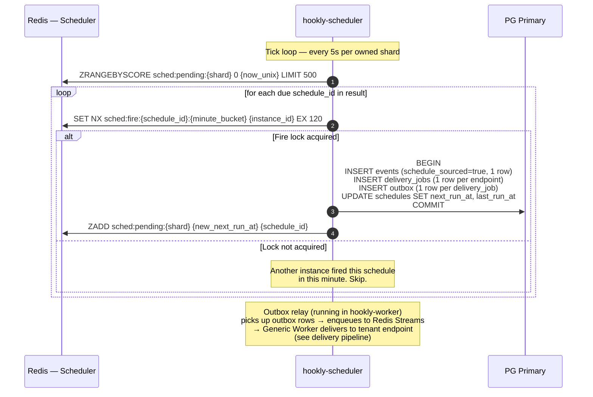

# Scheduled event flow

This document covers how the `hookly-scheduler` binary evaluates cron schedules, manages distributed shard ownership across multiple instances, and hands off fired jobs to the delivery pipeline.

For the delivery step itself — Streams pickup, worker pool, HTTP delivery, retries, circuit breaking — see the [delivery pipeline](delivery-pipeline.md).

---

## Overview

A cron schedule is a tenant-defined rule: "at this cron expression, POST this payload to these endpoints." The scheduler's job is to detect due schedules and emit events for them, without duplicate fires, even when multiple scheduler instances run concurrently.

Three concerns are kept separate:

1. **Shard ownership** — which scheduler instance is responsible for which subset of schedules
2. **Tick evaluation** — polling due schedules within owned shards and firing them
3. **Delivery handoff** — getting the fired event into the delivery pipeline reliably

---

## Shard ownership and multi-instance coordination

### Why shards

A single scheduler instance polling all schedules every 5s is both a single point of failure and a throughput ceiling. Sharding distributes the load:

- The schedule space is divided into `N` shards (default: 4, configurable)
- Each schedule is assigned to a shard deterministically: `schedule_id_bytes[0] % N`
- Each shard has its own Redis sorted set: `sched:pending:{shard}`
- Scheduler instances claim ownership of shards; each owned shard gets its own independent tick loop

Because assignment is hash-based and stable, the same schedule always maps to the same shard — no coordination is needed for placement.

### How a scheduler claims and holds shards

On startup, a scheduler instance scans all shard slots and claims any that have no current owner:

```
for shard in 0..N:
    SET sched:owner:{shard} {instance_id} NX EX 30
    → if OK: add shard to owned set, start tick loop for it
```

Once owned, a **heartbeat task** renews each owned shard's TTL every 10 seconds:

```
every 10s:
    for each owned shard:
        SET sched:owner:{shard} {instance_id} EX 30   ← unconditional refresh
```

The TTL is 30s; heartbeat fires every 10s. An instance must miss three consecutive heartbeats before a shard is considered orphaned. This gives a ~30s failover window.

### How each scheduler polls its shards

Each owned shard runs an **independent tick loop** every 5 seconds. If Scheduler A owns shards 0 and 1, it runs two concurrent tick loops:

```
Scheduler A                          Scheduler B
owns: shard 0, shard 1               owns: shard 2, shard 3

every 5s, shard 0:                   every 5s, shard 2:
  ZRANGEBYSCORE                        ZRANGEBYSCORE
    sched:pending:0 0 {now}              sched:pending:2 0 {now}

every 5s, shard 1:                   every 5s, shard 3:
  ZRANGEBYSCORE                        ZRANGEBYSCORE
    sched:pending:1 0 {now}              sched:pending:3 0 {now}
```

The two schedulers never touch each other's sorted sets during normal operation. If Scheduler B goes down, its shard owner keys expire after 30s, and A's next claim sweep picks them up. From that point, A runs tick loops for all four shards until B recovers or a new instance joins.

### Fire lock: preventing duplicate fires during shard handoff

During the ~30s window between a scheduler going down and another instance claiming its shards, the sorted set still holds all the due entries. When the surviving instance acquires an orphaned shard and starts its tick loop, it may see schedules that are now overdue. Additionally, two instances can briefly believe they own the same shard if a network partition delays TTL expiry.

The fire lock prevents double-firing in both cases:

```
SET sched:fire:{schedule_id}:{minute_bucket} {instance_id} NX EX 120
```

- `minute_bucket = floor(now_unix / 60)` — one slot per schedule per cron minute
- Only the instance that wins `SET NX` fires the schedule for that minute
- The loser skips silently — it was a race, not an error
- EX 120 (2 minutes) ensures the lock outlives the minimum cron resolution (1 minute) and covers clock skew

### Shard takeover: concrete timeline

```
t=0s   Scheduler A starts. Claims shards 0–3 (all unclaimed).
t=5s   Scheduler B starts. All shards 0–3 have A as owner; B waits.
       B's claim sweep finds nothing unclaimed — it owns zero shards.

       (Only possible in static-assignment mode. In dynamic mode B starts with zero
       shards and A's heartbeat fires at t=10s, so B never gets to claim 0–3.)

       For a 4-shard / 2-instance setup with static config:
         SCHEDULER_OWNED_SHARDS=0,1   → A
         SCHEDULER_OWNED_SHARDS=2,3   → B

t=0s   A owns shards 0, 1. B owns shards 2, 3.
t=10s  Both renew heartbeats.
t=15s  A crashes. sched:owner:0 and sched:owner:1 expire at t=40s (last renewal t=10s, TTL=30s).
t=40s  B's claim sweep: SET NX sched:owner:0 EX 30 → OK, SET NX sched:owner:1 EX 30 → OK.
       B now owns all four shards and runs four tick loops.

t=45s  During t=15s–t=40s, schedules in shards 0 and 1 were not polled.
       Their sorted set entries remain with their original scores.
       B's first tick for those shards picks them up as overdue.
       Fire locks ensure each overdue schedule fires at most once.
```

No schedules are lost. Delivery latency for shards 0 and 1 is at most ~25s (the gap between A's crash at t=15s and B's takeover at t=40s).

---

## Tick loop: sequence diagram



---

## Write amplification: the outbox cost

### Current writes per schedule fire

For a schedule with **M** endpoint subscriptions, one tick produces:

| Phase | Operation | DB writes |
|---|---|---|
| Scheduler tick | `INSERT events` | 1 |
| Scheduler tick | `INSERT delivery_jobs` | M |
| Scheduler tick | `INSERT outbox` | M |
| Scheduler tick | `UPDATE schedules` | 1 |
| Outbox relay | `UPDATE outbox SET status='published'` | M |
| **Total** | | **3M + 2** |

Redis writes (ZADD re-score + M×XADD) are not counted above — they are cheap and async.

Concrete examples:

| M (endpoints) | DB writes per fire |
|---|---|
| 1 | 5 |
| 5 | 17 |
| 10 | 32 |
| 50 | 152 |
| 100 | 302 |

### At scale

| Schedules/min | Endpoints/schedule | Writes/min | Writes/sec |
|---|---|---|---|
| 1,000 | 10 | 32,000 | ~533 |
| 5,000 | 10 | 160,000 | ~2,667 |
| 10,000 | 10 | 320,000 | ~5,333 |
| 1,000 | 50 | 152,000 | ~2,533 |
| 5,000 | 50 | 760,000 | ~12,667 |

PostgreSQL on a single primary handles roughly 5,000–15,000 simple writes/second under normal conditions. The current model can hit that ceiling at ~5,000 one-minute schedules with 10 endpoints each — well within the range of a growth-stage platform.

### Why the outbox is used here

The scheduler and the delivery worker are separate processes. Without the outbox, the scheduler fires by writing to PostgreSQL and then XADDing directly to Redis Streams. This creates a gap:

```
Scheduler: COMMIT (events + delivery_jobs written)
Scheduler: ← crashes here
Redis: never receives XADD for these jobs
```

The jobs exist in PostgreSQL but have no queue entry. Recovery requires a separate "stuck job" scanner that identifies delivery_jobs with no corresponding queue message and re-enqueues them — which is exactly what the outbox relay already does. Using the outbox here makes the scheduler crash-safe for free, using the same recovery path as everything else.

### Alternatives and their trade-offs

#### Option A: Fanout model (deferred delivery_jobs)

The scheduler writes only the minimum per fire:

```
Scheduler tick:
  BEGIN
  INSERT events (1 row)
  UPDATE schedules SET next_run_at, last_run_at (1 row)
  COMMIT
  ZADD sched:pending:{shard} {new_score} {id}   ← Redis, not DB
```

A **fanout worker** (a separate async task in the worker binary) then picks up the new event, looks up endpoint subscriptions, and creates delivery_jobs:

```
Fanout worker:
  SELECT endpoints WHERE event_type_id = $event_type_id AND status='active'
  bulk INSERT delivery_jobs (M rows, one query)
  XADD hookly:delivery:{tier}:{priority} for each job   ← direct, no outbox
```

**DB writes per fire:** 2 (scheduler) + M (fanout bulk, one INSERT) = M + 2, versus 3M + 2 today. The write count is cut by roughly two-thirds.

**Trade-off:**
- Fanout adds a second async hop between schedule fire and delivery enqueue. P99 delivery latency increases by however long the fanout worker takes to process the event.
- The fanout worker needs to be idempotent — re-running on the same event must not double-insert delivery_jobs.
- Delivery_jobs are no longer created atomically with the event; a fanout crash leaves an event with no delivery_jobs, requiring a recovery path.
- Endpoint subscription lookup moves from scheduler time to fanout time, where it runs against potentially stale data (read replica).

#### Option B: Single outbox row per event

Replace M outbox rows with one row per event carrying the endpoint list:

```sql
INSERT outbox (event_id, endpoint_ids, status)
  VALUES ($event_id, ARRAY[$ep1, $ep2, ...], 'pending')
```

The relay reads this one row, creates delivery_jobs in bulk, enqueues to Redis Streams, and marks the outbox row published:

```
Relay:
  SELECT from outbox FOR UPDATE SKIP LOCKED  → 1 row
  bulk INSERT delivery_jobs (M rows)
  XADD (M Redis writes)
  UPDATE outbox SET status='published'        → 1 row
```

**Scheduler DB writes per fire:** 1 (event) + M (delivery_jobs) + 1 (outbox) + 1 (schedule) = M + 3, versus 3M + 2 today. The relay update drops from M rows to 1 row.

The total write count is approximately halved. At M=10: 13 writes instead of 32. At M=50: 53 writes instead of 152.

**Trade-off:**
- The relay becomes responsible for delivery_job creation, not just relay. It must be idempotent.
- Outbox row size grows (endpoint_ids array), but this is negligible — UUIDs are small.
- Relay complexity increases slightly: it now does a JOIN or lookup to create delivery_jobs.

#### Option C: Direct-to-queue, no outbox

Scheduler writes events and schedule update, then XADDs directly to Redis:

```
BEGIN; INSERT events (1); UPDATE schedules (1); COMMIT
for each endpoint: XADD hookly:delivery:{tier}:{priority} {job}
```

**DB writes per fire:** 2, regardless of M. Redis writes: M. This is the minimum possible.

**Trade-off:** At-most-once semantics. If the scheduler crashes after COMMIT but before completing all M XADDs, some endpoints receive a queue entry and others do not, with no recovery path. Delivery_jobs would need to be created by the worker at dequeue time, which requires re-fetching schedule and endpoint data. Not acceptable for at-least-once delivery guarantees.

### Summary

| Option | DB writes per fire | Recovery path | Complexity |
|---|---|---|---|
| Current (outbox per job) | 3M + 2 | Relay re-reads pending outbox | Low |
| A: Fanout model | M + 2 | Fanout idempotency needed | Medium |
| B: Single outbox row | M + 3 | Relay idempotency needed | Low–Medium |
| C: Direct-to-queue | 2 | None (at-most-once) | Low |

**Migration path:** Option B (single outbox row) is the preferred next step. It cuts DB writes roughly in half with minimal structural change — the outbox table gains a column, the relay gains one bulk-insert step — and preserves at-least-once delivery semantics.

Option A (fanout model) is the right choice if endpoint subscription cardinality becomes the scaling concern (schedules fan out to hundreds of endpoints), because it decouples schedule fire latency from endpoint cardinality entirely.

---

## Reconciliation: handling missed fires

The reconciliation task runs every 2 minutes and re-syncs PostgreSQL state into the sorted sets:

```sql
SELECT id, next_run_at FROM schedules WHERE status = 'active'
```

For each active schedule, it upserts the score into `sched:pending:{shard}`. This catches:

- Schedules added via the API between reconciliation runs (the API also does a best-effort `ZADD` on create, but reconciliation is the safety net)
- Sorted set entries lost due to a Redis crash (all entries are rebuilt from PostgreSQL)
- Overdue schedules missed during a scheduler downtime window

See [ADR scheduler/002](../decisions/scheduler/002-missed-fire-policy.md) for the missed fire policy: whether an overdue schedule fires immediately on recovery, fires once and skips intermediate windows, or skips to the next future window.
