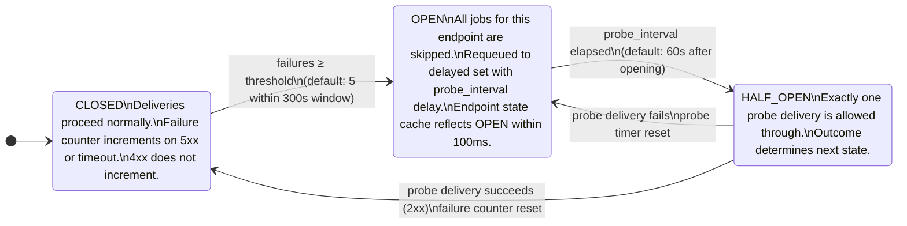
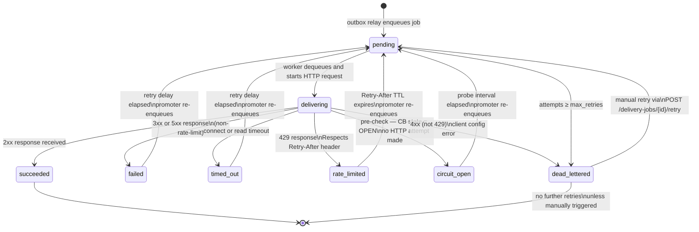
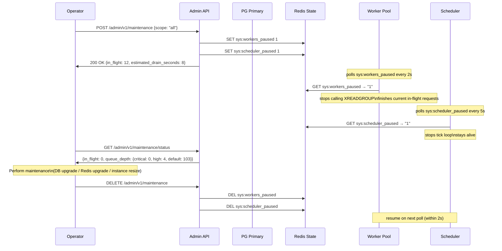

# System architecture diagram

This document shows the full Hookly system topology, the event delivery flow, and the key state machines.

For the scheduled event flow — shard ownership, multi-instance coordination, tick loop, and outbox write analysis — see [scheduled event flow](scheduled-event-flow.md).

---

## System topology

```mermaid
graph TB
    classDef client fill:#f0f9ff,stroke:#0ea5e9
    classDef binary fill:#dbeafe,stroke:#3b82f6
    classDef pg fill:#dcfce7,stroke:#16a34a
    classDef redis fill:#fef9c3,stroke:#ca8a04
    classDef external fill:#f5f5f5,stroke:#737373

    Client(["Tenant / Admin Client"]):::client

    subgraph api["hookly — API Server"]
        direction TB
        H[HTTP Handlers]
        ORA[Outbox Relay Task]
        MW[Middleware Stack\nrequest-id · body-limit · uri-limit]
    end

    subgraph sched["hookly-scheduler"]
        direction TB
        TK[Tick Loop\nevery 5s per owned shard]
        REC[Reconciliation Task\nevery 2 min]
        HB[Shard Heartbeat\nTTL refresh every 10s]
    end

    subgraph worker["hookly-worker"]
        direction TB
        WP[Work-Stealing Pool\nN Tokio tasks · priority floors]
        ORW[Outbox Relay Task]
        PR[Promoter Task\ndelayed → queue]
        RC[Recovery Task\nstuck delivering → re-enqueue]
        EC[Endpoint State Cache\nDashMap · 100ms refresh]
    end

    subgraph pg["PostgreSQL"]
        PGW[(Primary\nall writes)]:::pg
        PGR[(Read Replica\nlist queries · job reads)]:::pg
    end

    subgraph rq["Redis — Queue"]
        STR[("Streams\nhookly:delivery:{tier}:{priority}")]:::redis
        DEL[("Sorted Set\nhookly:delayed")]:::redis
    end

    subgraph rs["Redis — State"]
        CB[("Circuit Breaker\ncb:{ep}:state · cb:{ep}:failures")]:::redis
        RL[("Rate Limits\nratelimit:ep:{id}")]:::redis
        INF[("Inflight Counters\ninflight:tenant:{id}\ninflight:ep:{id}")]:::redis
        SYS[("Control Flags\nsys:workers_paused\nsys:scheduler_paused")]:::redis
    end

    subgraph rsc["Redis — Scheduler"]
        SS[("Sorted Sets\nsched:pending:{shard}")]:::redis
        FL[("Fire Locks\nsched:fire:{id}:{minute}")]:::redis
        OWN[("Shard Ownership\nsched:owner:{shard}")]:::redis
    end

    subgraph re["Redis — Ephemeral"]
        IK[("Idempotency\nidmp:{ns}:{key}")]:::redis
        EC2[("Endpoint State Snapshot\nfor cache refresh")]:::redis
    end

    Endpoint(["Tenant Webhook Endpoint"]):::external

    Client -->|REST API| MW --> H
    H -->|INSERT events + outbox\nATOMIC| PGW
    H -->|ZADD next_run_at| SS

    ORA -->|SELECT pending\nFOR UPDATE SKIP LOCKED| PGW
    ORA -->|XADD| STR
    ORA -->|UPDATE published| PGW

    HB -->|SET sched:owner EX 30| OWN
    TK -->|ZRANGEBYSCORE 0 now| SS
    TK -->|SET NX fire lock EX 120| FL
    TK -->|INSERT events + delivery_jobs + outbox| PGW
    TK -->|UPDATE next_run_at| PGW
    TK -->|ZADD new score| SS
    REC -->|SELECT schedules WHERE active| PGR
    REC -->|ZADD bulk sync| SS

    ORW -->|SELECT pending FOR UPDATE SKIP LOCKED| PGW
    ORW -->|XADD| STR
    ORW -->|UPDATE published| PGW

    PR -->|ZRANGEBYSCORE 0 now| DEL
    PR -->|XADD| STR
    PR -->|ZREM| DEL

    RC -->|SELECT delivering WHERE updated_at < now-5min| PGR
    RC -->|INSERT outbox| PGW

    WP -->|XREADGROUP| STR
    WP -->|GET sys:workers_paused| SYS
    EC -->|100ms poll| CB
    EC -->|100ms poll| RL
    EC -->|100ms poll| INF
    WP -.->|O1 lookup| EC
    WP -->|SELECT job · endpoint · secret| PGR
    WP -->|INCR inflight| INF
    WP -->|POST webhook + signature| Endpoint
    WP -->|UPDATE delivery_jobs| PGW
    WP -->|INCR/reset cb failures| CB
    WP -->|SET ratelimit EX| RL
    WP -->|DECR inflight| INF
    WP -->|ZADD delayed| DEL
    WP -->|XACK| STR
```



---

## Event delivery flow

Shows the path from event submission to delivery, with the normal path, 5xx retry, 429 rate limit, and circuit breaker open paths.

```mermaid
sequenceDiagram
    autonumber
    actor Client
    participant API as API Server
    participant PGW as PG Primary
    participant PGR as PG Replica
    participant Relay as Outbox Relay
    participant Queue as Redis Streams
    participant Delayed as Redis Delayed Set
    participant State as Redis State
    participant Cache as Endpoint State Cache
    participant Worker as Worker Pool
    participant EP as Tenant Endpoint

    Client->>API: POST /api/v1/events {payload}
    API->>PGW: BEGIN; INSERT events; INSERT delivery_jobs; INSERT outbox; COMMIT
    API->>Client: 202 Accepted {event_id, request_id}

    Note over Relay: runs every 100ms inside worker binary
    Relay->>PGW: SELECT FROM outbox WHERE status='pending'<br/>ORDER BY created_at LIMIT 200<br/>FOR UPDATE SKIP LOCKED
    Relay->>Queue: XADD hookly:delivery:{tier}:{priority} {delivery_job_id}
    Relay->>PGW: UPDATE outbox SET status='published', published_at=NOW()

    Worker->>Queue: XREADGROUP GROUP hookly-workers CONSUMER w1 COUNT 1 BLOCK 5000
    Worker->>State: GET sys:workers_paused
    Worker->>Cache: Lookup endpoint_id → O(1) in-memory check

    alt Endpoint is blocked (rate-limited / CB open / max inflight)
        Cache->>Worker: state = RateLimited | CircuitOpen | MaxInflight
        Worker->>Delayed: ZADD hookly:delayed {unblock_at} {job} (pipelined)
        Worker->>Queue: XACK
        Note over Worker: slot released in microseconds — no HTTP attempt
    else Endpoint available
        Worker->>PGR: SELECT endpoint url, signing_secret, timeouts, max_retries
        Worker->>State: INCR inflight:tenant:{id}; INCR inflight:ep:{id} (Lua, atomic)
        Worker->>PGW: UPDATE delivery_jobs SET status='delivering', started_at=NOW()

        Worker->>EP: POST /webhook {payload}<br/>X-Hookly-Signature: sha256=…<br/>X-Hookly-Event: {type}<br/>X-Hookly-Delivery: {attempt_id}

        alt 2xx Success
            EP->>Worker: 200 OK {body}
            Worker->>PGW: UPDATE delivery_jobs SET status='succeeded', completed_at=NOW()
            Worker->>State: DECR inflight:tenant; DECR inflight:ep
            Worker->>State: DEL cb:{ep}:failures (reset circuit breaker counter)
            Worker->>Queue: XACK

        else 5xx or Timeout
            EP->>Worker: 503 Service Unavailable (or read timeout)
            Worker->>State: INCR cb:{ep}:failures EX 300
            Worker->>PGW: UPDATE delivery_jobs SET status='failed',<br/>attempts=attempts+1, next_retry_at={backoff}
            Worker->>State: DECR inflight:tenant; DECR inflight:ep
            Worker->>Delayed: ZADD hookly:delayed {next_retry_at_unix} {job}
            Worker->>Queue: XACK
            Note over Delayed: Promoter task wakes at next_retry_at,<br/>moves job back to hookly:delivery:default or :slow

            Note over State: If failures >= threshold (default 5)<br/>→ SET cb:{ep}:state=open, cb:{ep}:opens_at=now<br/>→ Cache refreshes within 100ms<br/>→ Subsequent jobs skip immediately

        else 429 Rate Limited
            EP->>Worker: 429 Too Many Requests [Retry-After: 60]
            Worker->>State: SET ratelimit:ep:{id} blocked EX 60
            Worker->>State: DECR inflight:tenant; DECR inflight:ep
            Worker->>Delayed: ZADD hookly:delayed {now+60} {job}
            Worker->>Queue: XACK
            Note over Cache: Cache refreshes within 100ms<br/>All pending jobs for this endpoint<br/>skip immediately until TTL expires

        else 4xx (not 429)
            EP->>Worker: 400 Bad Request
            Worker->>PGW: UPDATE delivery_jobs SET status='dead_lettered'
            Worker->>State: DECR inflight:tenant; DECR inflight:ep
            Worker->>Queue: XACK
            Note over Worker: Client config error — retrying will not help.<br/>Tenant must fix endpoint and manually retry.
        end
    end
```

---

## Circuit breaker state machine



---

## Delivery job state machine



---

## Maintenance and upgrade flow


